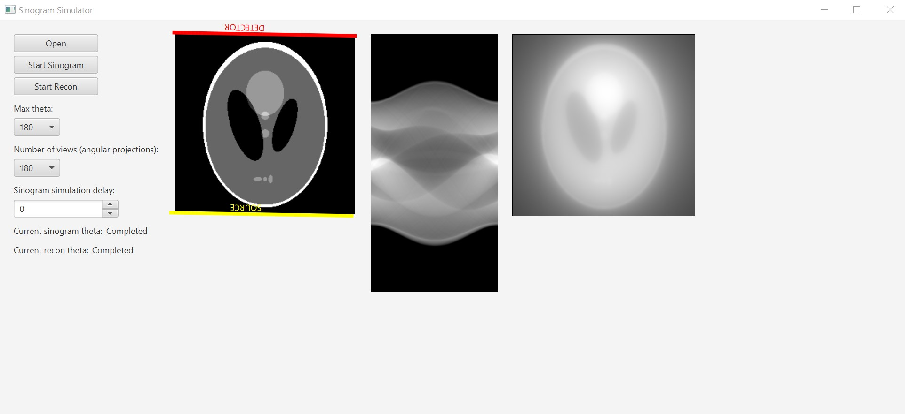

# sinogram-simulator

Sinogram simulator is a Java implementation of Radon transform and back projection of 2D images.

## How to use the simulator

Build:

`$ mvn compile`

Run:

`$ mvn exec:java -Dexec.mainClass="sinogram.simulator.Main"`

To build a stand-alone JAR file:

`$ mvn package`